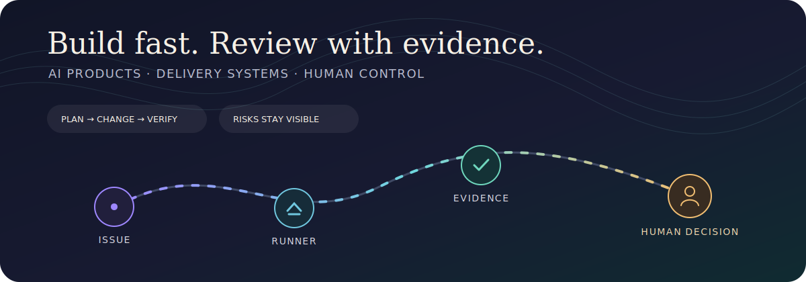
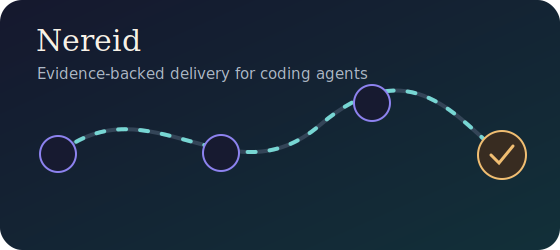
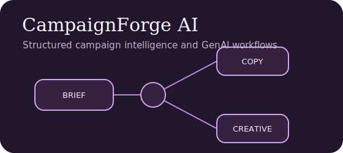
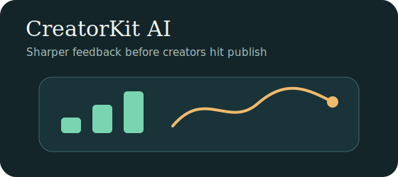
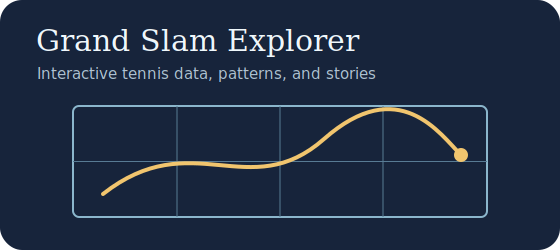

<h1 align="center">Tim Finch</h1>

  Building evidence-backed AI products and the systems that keep humans in control. 
  <a href="https://portfolio-site-gamma-ten-55.vercel.app">Portfolio</a> ·
  <a href="https://www.linkedin.com/in/tim-finch00/">LinkedIn</a> ·
  <a href="https://github.com/Peippo1/Nereid">Nereid</a>

  

## What I’m working on

### [Nereid](https://github.com/Peippo1/Nereid) — trusted delivery for coding agents

Coding agents can write code faster than a reviewer can safely reconstruct it. Nereid turns a GitHub issue into a customer-run delivery with an evidence packet: the plan, changes, verification, risks, and a human decision. Repositories and Codex credentials stay in the customer environment; Nereid records evidence and never merges.

It is a technical preview built in public during the OpenAI Hackathon. The current work is making the control plane durable, reviewable, and safe enough for early design partners.

## Selected work

| | |
|:---:|:---:|
|  |  |
| **[Nereid](https://github.com/Peippo1/Nereid)** Customer-controlled execution, immutable evidence, and human-only approval. | **[CampaignForge AI](https://github.com/Peippo1/CampaignForge-AI)** Campaign intelligence from brief to copy and creative concepts. |
|  |  |
| **[CreatorKit AI](https://github.com/Peippo1/creatorkit-ai)** Practical feedback to assess and improve content before publishing. | **[Grand Slam Explorer](https://github.com/Peippo1/Grand-Slam-Explorer)** Interactive tennis analytics built with Next.js, TypeScript, and Recharts. |

More case studies, build notes, and experiments are on my [portfolio](https://portfolio-site-gamma-ten-55.vercel.app).

## Code telemetry

  

This is a July 2026 snapshot of the four public projects above, calculated from GitHub’s repository language data. It represents code volume—not proficiency, time, or the full range of tools I use. The [source snapshot](./assets/code-telemetry-data.json) is kept alongside the graphic so the numbers can be checked and refreshed.

## How I like to build

- Start with a real workflow and make the trade-offs visible.
- Use structured outputs, tests, and explicit guardrails around AI behaviour.
- Keep data, credentials, and approval boundaries clear.
- Ship small vertical slices, learn from them, then make the next version more durable.

## Tools I reach for

TypeScript · Next.js · React · Node.js · Python · FastAPI · Postgres · Drizzle · Docker · GitHub Actions · OpenAI APIs · data pipelines and evaluation tooling

## Find me

- [Portfolio](https://portfolio-site-gamma-ten-55.vercel.app)
- [LinkedIn](https://www.linkedin.com/in/tim-finch00/)
- [GitHub](https://github.com/Peippo1)
