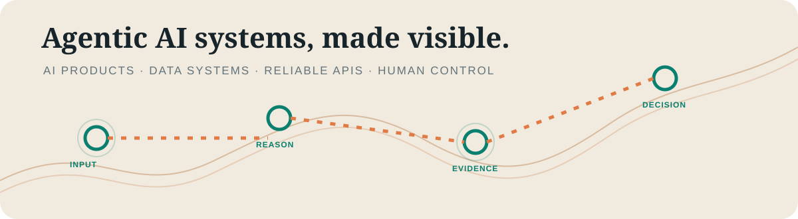
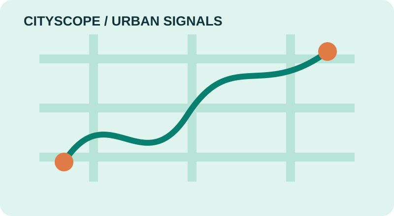
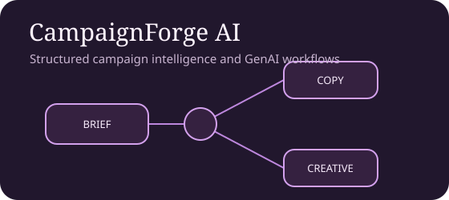
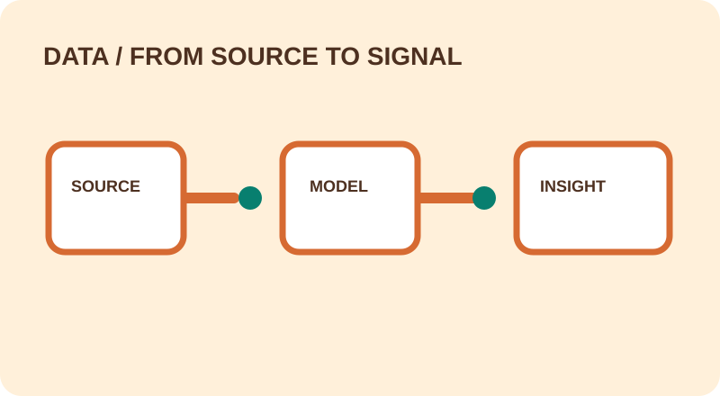
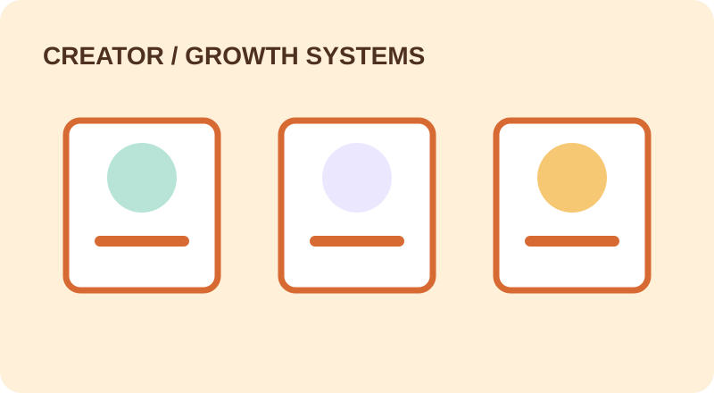
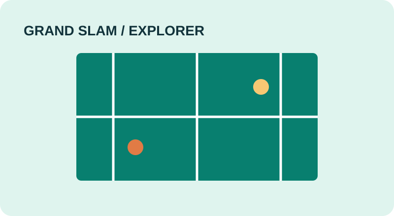
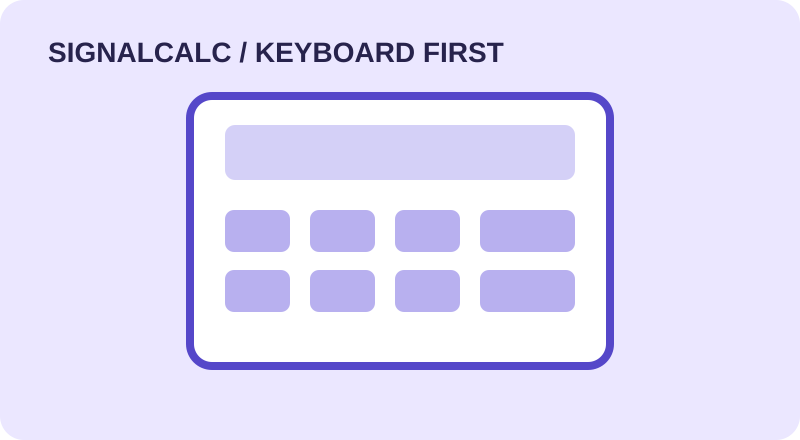
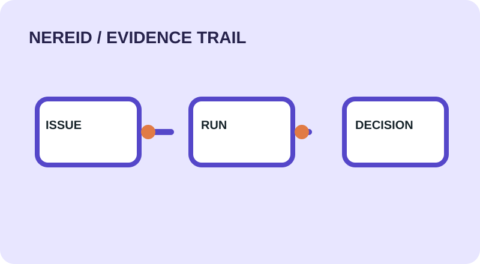

<h1 align="center">Tim Finch</h1>

<strong>Agentic AI systems, made visible.</strong>

AI implementation engineer building useful systems around real data.

AI engineering · data products · APIs · automation · product systems

  <a href="https://www.linkedin.com/in/tim-finch00/">LinkedIn</a>
  &nbsp;·&nbsp; <a href="https://portfolio-site-gamma-ten-55.vercel.app">Portfolio</a>
  &nbsp;·&nbsp; <a href="https://peippo1.github.io/Peippo1/">Open the full project index ↗</a>

<picture>
  <source media="(prefers-color-scheme: dark)" srcset="./assets/profile-banner-dark.svg" />
  <source media="(prefers-color-scheme: light)" srcset="./assets/profile-banner-light.svg" />
  
</picture>

## What I build

I turn emerging AI capabilities into practical software: structured workflows, data pipelines, APIs, and interfaces that people can actually use. My work sits at the intersection of AI engineering, product development, and operational reliability.

I care about the layer around the model — clear inputs, useful outputs, explicit constraints, observable behaviour, and a human who stays in control.

## Current build

### [Nereid](https://github.com/Peippo1/Nereid) — evidence-backed delivery for coding agents

Nereid turns a GitHub issue into a customer-run delivery with a reviewable evidence packet: the plan, changes, verification, risks, and a human decision. Repositories and credentials stay in the customer environment; Nereid records the trail and never merges.

 

## Project index

Twelve projects across agentic AI, data systems, APIs, automation, and interfaces. Each card links directly to the repository or live demo.

<table>
<tr>
<td width="50%" valign="top">

<h3><a href="https://github.com/Peippo1/CityScope">CityScope</a> ACTIVE</h3>
Evidence-grounded geospatial intelligence for London cycling. Python · Gemini · MCP · Google Cloud
</td>
<td width="50%" valign="top">

<h3><a href="https://github.com/Peippo1/cityscout-public">CityScout</a> ACTIVE</h3>
Local-first travel planning with AI-generated itineraries. SwiftUI · FastAPI · AI
</td>
</tr>
<tr>
<td width="50%" valign="top">

<h3><a href="https://github.com/Peippo1/CampaignForge-AI">CampaignForge AI</a> PRODUCT</h3>
Campaign intelligence from structured briefs to copy and concepts. Python · FastAPI · Spark · SQL
</td>
<td width="50%" valign="top">

<h3><a href="https://github.com/Peippo1/Smart-Reply-Service">Smart Reply Service</a> API</h3>
Channel-aware reply drafts with constraints and confidence scoring. Python · FastAPI · LLMs
</td>
</tr>
<tr>
<td width="50%" valign="top">

<h3><a href="https://github.com/Peippo1/TrendNest">TrendNest</a> EXPERIMENT</h3>
A pipeline for extracting, modelling, summarising, and visualising trends. Python · SQL · BigQuery · Streamlit
</td>
<td width="50%" valign="top">

<h3><a href="https://github.com/Peippo1/CreatorOS">CreatorOS</a> PRODUCT</h3>
Structured growth packs from creator research and transcripts. TypeScript · React · AI agents
</td>
</tr>
<tr>
<td width="50%" valign="top">

<h3><a href="https://github.com/Peippo1/creatorkit-ai">CreatorKit AI</a> PRODUCT</h3>
Feedback that helps creators improve content before publishing. Python · FastAPI · LLMs
</td>
<td width="50%" valign="top">

<h3><a href="https://github.com/Peippo1/Grand-Slam-Explorer">Grand Slam Explorer</a> DASHBOARD</h3>
Interactive analytics across four major tennis tournaments. Next.js · TypeScript · Recharts
</td>
</tr>
<tr>
<td width="50%" valign="top">

<h3><a href="https://github.com/Peippo1/SignalCalc">SignalCalc</a> PRODUCT</h3>
An accessible, keyboard-first calculator with history and persistence. React · JavaScript · Vite
</td>
<td width="50%" valign="top">

<h3><a href="https://github.com/Peippo1/DropWire">DropWire</a> AUTOMATION</h3>
Syncs Raindrop.io bookmarks to Teams and Google Sheets. Python · APIs · Google Sheets
</td>
</tr>
<tr>
<td width="50%" valign="top">

<h3><a href="https://github.com/Peippo1/Focus-Agent">Focus Agent</a> AGENT</h3>
A containerised assistant for calculations, summaries, files, and workflows. Python · FastAPI · LangChain · Docker
</td>
<td width="50%" valign="top">

<h3><a href="https://github.com/Peippo1/Nereid">Nereid</a> ACTIVE</h3>
Customer-controlled delivery for coding agents with evidence at every step. AI agents · delivery systems · human control
</td>
</tr>
</table>

## How I like to build

- Start with a real workflow and make the trade-offs visible.
- Use structured outputs, tests, and explicit guardrails around AI behaviour.
- Keep data, credentials, and approval boundaries clear.
- Ship a small vertical slice, learn from it, then make the next version more durable.

## Tools I reach for

**AI & application:** OpenAI APIs · Gemini · LangChain · agent workflows · structured generation

**Product & backend:** TypeScript · React · Next.js · SwiftUI · Python · FastAPI · Node.js

**Data & delivery:** SQL · Postgres · BigQuery · DuckDB · Spark · Streamlit · Docker · GitHub Actions

## FinchWorks Studio

I build developer-focused digital products and practical AI starter kits through [FinchWorks Studio](https://finchworksstudio.lemonsqueezy.com).

Building in public, one useful system at a time.

