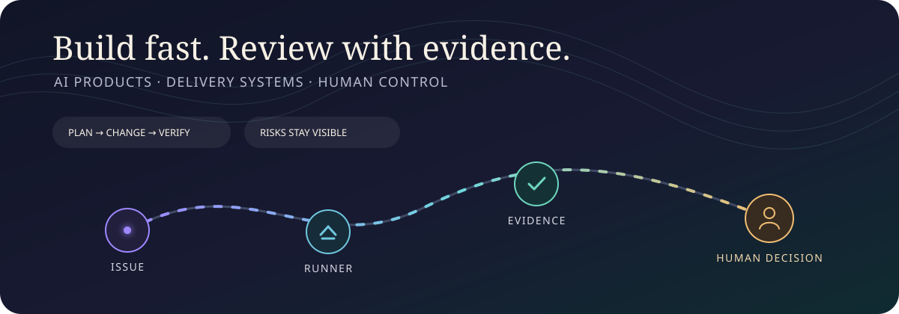

<h1 align="center">Tim Finch</h1>

<strong>Agentic AI systems, made visible.</strong>

AI implementation engineer building useful systems around real data.

AI engineering · data products · APIs · automation · product systems

  <a href="https://peippo1.github.io/Peippo1/"><strong>Explore the project dashboard →</strong></a>
  &nbsp;·&nbsp; <a href="https://portfolio-site-gamma-ten-55.vercel.app">Portfolio</a>
  &nbsp;·&nbsp; <a href="https://www.linkedin.com/in/tim-finch00/">LinkedIn</a>

## What I build

I turn emerging AI capabilities into practical software: structured workflows, data pipelines, APIs, and interfaces that people can actually use. My work sits at the intersection of AI engineering, product development, and operational reliability.

I care about the layer around the model — clear inputs, useful outputs, explicit constraints, observable behaviour, and a human who stays in control.

## Current build

### [Nereid](https://github.com/Peippo1/Nereid) — evidence-backed delivery for coding agents

Nereid turns a GitHub issue into a customer-run delivery with a reviewable evidence packet: the plan, changes, verification, risks, and a human decision. Repositories and credentials stay in the customer environment; Nereid records the trail and never merges.

 

## Selected projects

| Project | What it explores | Built with |
| --- | --- | --- |
| [CityScout](https://github.com/Peippo1/cityscout-public) | Local-first travel planning with AI-generated itineraries, saved places, and trip workflows. | SwiftUI · FastAPI · AI |
| [CampaignForge AI](https://github.com/Peippo1/CampaignForge-AI) | Campaign intelligence from structured briefs to copy, concepts, and analytics. | Python · FastAPI · Spark · SQL |
| [Smart Reply Service](https://github.com/Peippo1/Smart-Reply-Service) | Channel-aware reply generation with constraints, confidence scoring, and rate limits. | Python · FastAPI · LLMs |
| [TrendNest](https://github.com/Peippo1/TrendNest) | A modular pipeline for extracting, modelling, summarising, and visualising trends. | Python · SQL · BigQuery · Streamlit |

<a href="https://peippo1.github.io/Peippo1/">Browse the interactive dashboard for filters, architecture notes, and live links →</a>

## How I like to build

- Start with a real workflow and make the trade-offs visible.
- Use structured outputs, tests, and explicit guardrails around AI behaviour.
- Keep data, credentials, and approval boundaries clear.
- Ship a small vertical slice, learn from it, then make the next version more durable.

## Tools I reach for

**AI & application:** OpenAI APIs · Gemini · LangChain · agent workflows · structured generation

**Product & backend:** TypeScript · React · Next.js · SwiftUI · Python · FastAPI · Node.js

**Data & delivery:** SQL · Postgres · BigQuery · DuckDB · Spark · Streamlit · Docker · GitHub Actions

## FinchWorks Studio

I build developer-focused digital products and practical AI starter kits through [FinchWorks Studio](https://finchworksstudio.lemonsqueezy.com). The goal is simple: help people ship faster while keeping the engineering patterns understandable.

## Find me

[GitHub](https://github.com/Peippo1) · [LinkedIn](https://www.linkedin.com/in/tim-finch00/) · [Portfolio](https://portfolio-site-gamma-ten-55.vercel.app) · [FinchWorks Studio](https://finchworksstudio.lemonsqueezy.com)

Building in public, one useful system at a time.

